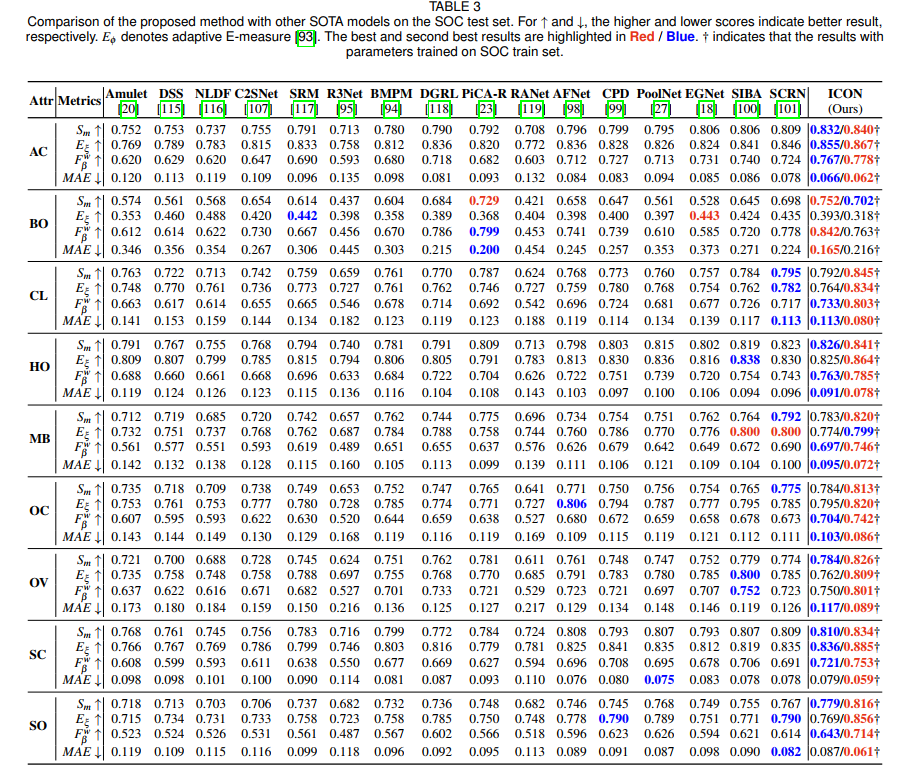

# Efficient SOC Toolbox / [SOC快速评测工具(中文Readme)](README_CN.md)

## 1. Datasets and Training Setting

Noted that, in our [ICON (arXiv, 2021）](https://arxiv.org/pdf/2101.07663.pdf), we use the following setting:

- Using both train and val set of SOC to train our model.
- Dropping out images without salient objects for training and testing.

Thus, our Training and Testing set are 2400 and 600, respectively.  

For a quick employment, you can download the updated SOC on [Baidu | 提取码: iqul ](https://pan.baidu.com/s/1kWebPUhCQOCsvvAouo7eGQ). 

**If you download SOC on above link, you can ignore procedures below.**

----

(A) You can generates train.txt list which drops images without salient objects by


```
python ./Train/SOC/drop_blank_and_generate_list.py 
```

(B) You can segment 8 attributes of testing set and their test.txt by

```
python ./Test/SOC/attr_categoty_and_generate_list.py 
```

Then 8 file folders will be generated, which are `./datasets/SOC/Test/SOC-AC`, `./datasets/SOC/Test/SOC-BO`, `./datasets/SOC/Test/SOC-CL`, `./datasets/SOC/Test/SOC-HO`, `./datasets/SOC/Test/SOC-MB`, `./datasets/SOC/Test/SOC-OC`, `./datasets/SOC/Test/SOC-OV`, `./datasets/SOC/Test/SOC-SO`. They contain the images and GTs of each category. 

**Actually, we have already processed A and B if you download SOC from above link.** (If needing, the original SOC dataset can be found [here](https://dpfan.net/socbenchmark/) and you can do A and B yourself.)

## 2. Evaluation

When your training process has done, you should generate the predictions of `SOC-AC`, `SOC-BO`, `SOC-CL`, `SOC-HO`, `SOC-MB`, `SOC-OC`, `SOC-OV` and `SOC-SO`, respectively.

When you have already generated all SOC-Test, an alternative method is to add `Attributes` files to prediction file, such as `Prediction/**Your_Method**/SOC/Attributes` then slightly modify the path in `Prediction/*Your_Method**/SOC/attr_categoty_and_generate_list.py` to automatively split your predicted saliency maps to 8 attributes.


After that, you can evaluate your performance on SOC in ~2 minutes. 

```
sh run_eval.sh
```

## 3. Results by SOCToolbox
The saliency maps of ICON can be found in [Baidu | 提取码:bopg](https://pan.baidu.com/s/19XV19I_0gfAjx2gwcweZcw).

```
Method:ICON,Dataset:SOC,Attribute:SOC-AC||Smeasure:0.84; wFmeasure:0.778; MAE:0.062; adpEm:0.89; meanEm:0.885; maxEm:0.894; adpFm:0.803; meanFm:0.806; maxFm:0.822
Method:ICON,Dataset:SOC,Attribute:SOC-BO||Smeasure:0.7; wFmeasure:0.762; MAE:0.216; adpEm:0.599; meanEm:0.725; maxEm:0.787; adpFm:0.739; meanFm:0.811; maxFm:0.862
Method:ICON,Dataset:SOC,Attribute:SOC-CL||Smeasure:0.845; wFmeasure:0.803; MAE:0.08; adpEm:0.874; meanEm:0.883; maxEm:0.893; adpFm:0.835; meanFm:0.834; maxFm:0.847
Method:ICON,Dataset:SOC,Attribute:SOC-HO||Smeasure:0.841; wFmeasure:0.785; MAE:0.078; adpEm:0.873; meanEm:0.88; maxEm:0.892; adpFm:0.81; meanFm:0.815; maxFm:0.834
Method:ICON,Dataset:SOC,Attribute:SOC-MB||Smeasure:0.82; wFmeasure:0.746; MAE:0.072; adpEm:0.846; meanEm:0.862; maxEm:0.87; adpFm:0.772; meanFm:0.781; maxFm:0.794
Method:ICON,Dataset:SOC,Attribute:SOC-OC||Smeasure:0.813; wFmeasure:0.742; MAE:0.086; adpEm:0.847; meanEm:0.859; maxEm:0.873; adpFm:0.775; meanFm:0.78; maxFm:0.8
Method:ICON,Dataset:SOC,Attribute:SOC-OV||Smeasure:0.826; wFmeasure:0.801; MAE:0.089; adpEm:0.86; meanEm:0.872; maxEm:0.88; adpFm:0.833; meanFm:0.833; maxFm:0.844
Method:ICON,Dataset:SOC,Attribute:SOC-SO||Smeasure:0.816; wFmeasure:0.714; MAE:0.061; adpEm:0.869; meanEm:0.873; maxEm:0.884; adpFm:0.734; meanFm:0.745; maxFm:0.766
```

## 4. Others methods 
Others 20 SOD methods on SOC dataset can be found on [baidu yun](https://pan.baidu.com/s/1eGGokt33eaZGsJ5n5VRt4Q) (code: z3fq): [DSS](https://openaccess.thecvf.com/content_cvpr_2017/papers/Hou_Deeply_Supervised_Salient_CVPR_2017_paper.pdf)、[NLDF](https://openaccess.thecvf.com/content_cvpr_2017/papers/Luo_Non-Local_Deep_Features_CVPR_2017_paper.pdf)、[SRM](https://openaccess.thecvf.com/content_ICCV_2017/papers/Wang_A_Stagewise_Refinement_ICCV_2017_paper.pdf)、[Amulet](https://openaccess.thecvf.com/content_ICCV_2017/papers/Zhang_Amulet_Aggregating_Multi-Level_ICCV_2017_paper.pdf)、[DGRL](https://openaccess.thecvf.com/content_cvpr_2018/papers/Wang_Detect_Globally_Refine_CVPR_2018_paper.pdf)、[BMPM](https://openaccess.thecvf.com/content_cvpr_2018/papers_backup/Zhang_A_Bi-Directional_Message_CVPR_2018_paper.pdf)、[PiCANet-R](https://openaccess.thecvf.com/content_cvpr_2018/papers/Liu_PiCANet_Learning_Pixel-Wise_CVPR_2018_paper.pdf)、[R3Net](https://www.ijcai.org/Proceedings/2018/0095.pdf)、[C2S-Net](https://openaccess.thecvf.com/content_ECCV_2018/papers/Xin_Li_Contour_Knowledge_Transfer_ECCV_2018_paper.pdf)、[RANet](https://openaccess.thecvf.com/content_ECCV_2018/papers/Shuhan_Chen_Reverse_Attention_for_ECCV_2018_paper.pdf)、[CPD](https://openaccess.thecvf.com/content_CVPR_2019/papers/Wu_Cascaded_Partial_Decoder_for_Fast_and_Accurate_Salient_Object_Detection_CVPR_2019_paper.pdf)、[AFN](https://openaccess.thecvf.com/content_CVPR_2019/papers/Feng_Attentive_Feedback_Network_for_Boundary-Aware_Salient_Object_Detection_CVPR_2019_paper.pdf)、[BASNet](https://openaccess.thecvf.com/content_CVPR_2019/papers/Qin_BASNet_Boundary-Aware_Salient_Object_Detection_CVPR_2019_paper.pdf)、[PoolNet](https://openaccess.thecvf.com/content_CVPR_2019/papers/Liu_A_Simple_Pooling-Based_Design_for_Real-Time_Salient_Object_Detection_CVPR_2019_paper.pdf)、[SCRN](https://openaccess.thecvf.com/content_ICCV_2019/papers/Wu_Stacked_Cross_Refinement_Network_for_Edge-Aware_Salient_Object_Detection_ICCV_2019_paper.pdf)、[SIBA](https://openaccess.thecvf.com/content_ICCV_2019/papers/Su_Selectivity_or_Invariance_Boundary-Aware_Salient_Object_Detection_ICCV_2019_paper.pdf)、[EGNet](https://openaccess.thecvf.com/content_ICCV_2019/papers/Zhao_EGNet_Edge_Guidance_Network_for_Salient_Object_Detection_ICCV_2019_paper.pdf)、[F3Net](https://aaai.org/ojs/index.php/AAAI/article/view/6916)、[GCPANet](https://aaai.org/ojs/index.php/AAAI/article/view/6633)、[MINet](https://openaccess.thecvf.com/content_CVPR_2020/papers/Pang_Multi-Scale_Interactive_Network_for_Salient_Object_Detection_CVPR_2020_paper.pdf).

If you want to re-evaluate these methods by using SOCToolbox, please add `Attributes` files to prediction file, such as `Prediction/MINet/SOC/Attributes` and  slightly modify the path in `Prediction/MINet/SOC/attr_categoty_and_generate_list.py` to automatively split 8 attributes.

Comparison:

 

## 5. Acknowledgement
Some codes borrowed from:
* <https://github.com/lartpang/PySODMetrics> 

SOC results of other methods:
* <https://github.com/wuzhe71/SCRN> 

## Reference

```text
@inproceedings{Smeasure,
    title={Structure-measure: A new way to evaluate foreground maps},
    author={Fan, Deng-Ping and Cheng, Ming-Ming and Liu, Yun and Li, Tao and Borji, Ali},
    booktitle=ICCV,
    pages={4548--4557},
    year={2017}
}

@inproceedings{Emeasure,
    title="Enhanced-alignment Measure for Binary Foreground Map Evaluation",
    author="Deng-Ping {Fan} and Cheng {Gong} and Yang {Cao} and Bo {Ren} and Ming-Ming {Cheng} and Ali {Borji}",
    booktitle=IJCAI,
    pages="698--704",
    year={2018}
}

@article{zhuge2021salient,
  title={Salient Object Detection via Integrity Learning},
  author={Zhuge, Mingchen and Fan, Deng-Ping and Liu, Nian and Zhang, Dingwen and Xu, Dong and Shao, Ling},
  journal={arXiv preprint arXiv:2101.07663},
  year={2021}
}
```

